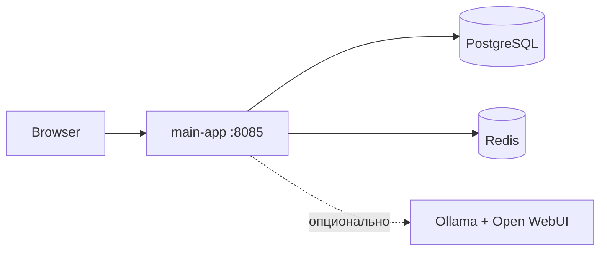
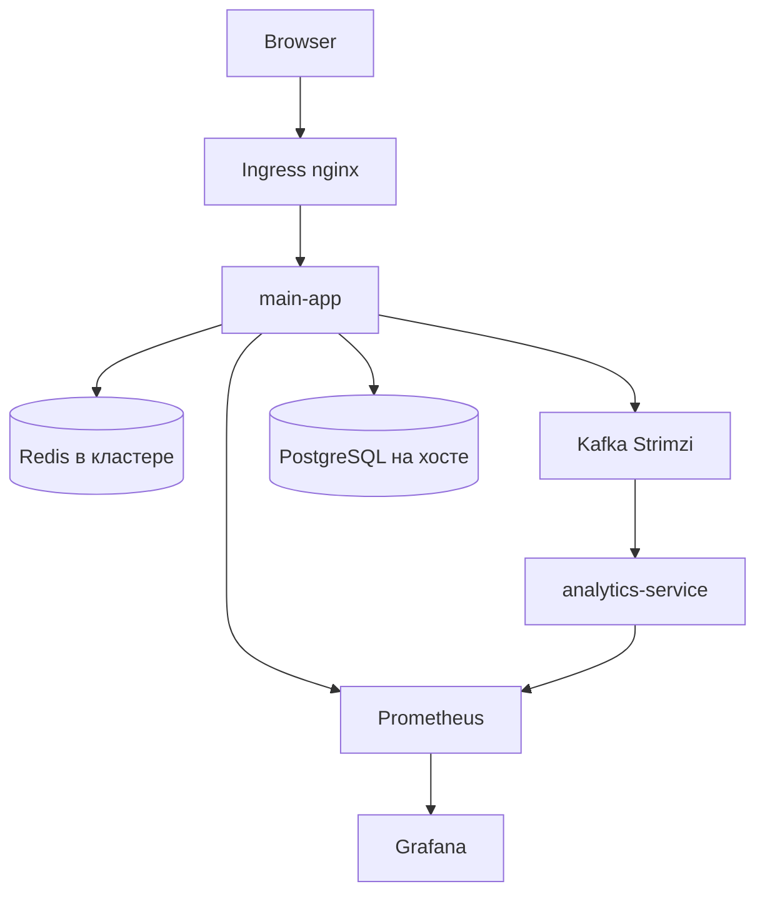

# BookStore (MyBookShopApp)

Учебный **книжный интернет-магазин** с микросервисной архитектурой: Spring Boot, Kafka, Redis, PostgreSQL, observability и деплой в Kubernetes (Helm + kind). Подходит для портфолио и экспериментов с современным backend/DevOps-стеком.

| Сценарий | Что получите |
|----------|----------------|
| **Быстро посмотреть UI** | [Docker Compose](#быстрый-старт-docker-compose) — Postgres, Redis, приложение за несколько минут |
| **Разработка в IDE** | [Локальный запуск через Maven](#локальная-разработка-maven) |
| **K8s, метрики, Kafka** | [Запуск в kind](#запуск-в-kubernetes-kind) |

---

## Содержание

- [Состав репозитория](#состав-репозитория)
- [Архитектура](#архитектура)
- [Технологии](#технологии)
- [Требования](#требования)
- [Быстрый старт (Docker Compose)](#быстрый-старт-docker-compose)
- [Локальная разработка (Maven)](#локальная-разработка-maven)
- [Запуск в Kubernetes (kind)](#запуск-в-kubernetes-kind)
- [Мониторинг и логи](#мониторинг-и-логи)
- [Справочник команд](#справочник-команд)
- [Разработка](#разработка)
- [Автор](#автор)

---

## Состав репозитория

```
bookstore/
├── src/                          # main-app (MyBookShopApp) — магазин, API, UI
├── analytics-service/            # микросервис аналитики (Kafka Streams)
├── bookstore-chart/              # Helm-чарт для Kubernetes
├── docker-compose.yml            # локальная инфраструктура
├── kind-config.yaml              # конфиг кластера kind
├── kafka-cluster.yaml            # Kafka (Strimzi) для K8s
└── Dockerfile                    # образ main-app
```

| Модуль | Порт (по умолчанию) | Роль |
|--------|---------------------|------|
| **main-app** | `8085` | Каталог, заказы, пользователи; producer событий в Kafka |
| **analytics-service** | `8086` | Consumer: популярность книг (Kafka Streams) |
| **PostgreSQL** | `5432` | Основная БД |
| **Redis** | `6379` | Кэш, сессии |

---

## Архитектура

### Локально (Docker Compose)



### В Kubernetes (kind + Helm)



### Где что развёрнуто в K8s

| Компонент | Размещение | Зачем так |
|-----------|------------|-----------|
| PostgreSQL | **Вне кластера** (хост / Docker) | Имитация managed DB в облаке |
| Redis, Kafka, приложения | **В кластере** | Практика StatefulSet, PVC, микросервисы |
| Prometheus, Grafana, Loki | **Helm-зависимости** | Observability из коробки |

**Поток событий:** просмотр книги → `main-app` публикует в топик `book-views` → `analytics-service` агрегирует популярность (оконные вычисления, state в RocksDB через Kafka Streams).

---

## Технологии

**Backend:** Java 17, Spring Boot 3, Spring Security (JWT, OAuth2), JPA, Spring Kafka  
**Данные:** PostgreSQL, Redis, Kafka (+ Kafka Streams в analytics)  
**UI:** Thymeleaf, TypeScript / AngularJS (`spring-frontend/`)  
**Инфра:** Docker, Docker Compose, Kubernetes (kind), Helm, Strimzi, Ingress  
**Наблюдаемость:** Prometheus, Grafana, Loki, Alertmanager, ServiceMonitor  
**Сборка:** Maven  
**Опционально (Compose):** Ollama + Open WebUI для RAG-чата по документам проекта  

> Liquibase есть в проекте, но в `application.properties` по умолчанию отключён (`spring.liquibase.enabled=false`); схема поднимается через Hibernate + SQL-скрипты при старте.

---

## Требования

| Инструмент | Нужен для |
|------------|-----------|
| Docker + Docker Compose | Быстрый старт, образы |
| Java 17+, Maven | Локальная разработка |
| kind, kubectl, Helm 3.x | Kubernetes |
| PostgreSQL 14+ | Если поднимаете БД без Compose |

---

## Быстрый старт (Docker Compose)

Поднимает Postgres, Redis, приложение и (опционально) Swagger UI и RAG-стек.

```bash
# из корня репозитория
docker compose up -d postgres redis app
```

| Сервис | URL |
|--------|-----|
| Приложение | http://localhost:8080 |
| Swagger UI | http://localhost:8081 |
| Open WebUI (RAG) | http://localhost:3000 |
| Ollama API | http://localhost:11434 |

Полный стек с Ollama и чатом:

```bash
docker compose up -d
```

Остановка:

```bash
docker compose down
```

---

## Локальная разработка (Maven)

### 1. Инфраструктура

```bash
docker compose up -d postgres redis
```

Либо свой PostgreSQL (macOS: `brew services start postgresql@14`).

### 2. main-app

Настройте подключение к БД в `src/main/resources/application.properties` (или через переменные окружения / профиль).

```bash
mvn clean package
java -jar target/MyBookShopApp-0.0.1-SNAPSHOT.jar
```

Приложение: http://localhost:8085

### 3. analytics-service (отдельно)

```bash
cd analytics-service
mvn spring-boot:run
```

Сервис: http://localhost:8086  

Для работы с Kafka нужен доступный брокер и согласованные настройки в `analytics-service/src/main/resources/application.properties`.

> **Важно:** не коммитьте реальные пароли, ключи OAuth, JWT secret и токены в `application.properties`. Для локальной работы используйте env-переменные или `application-local.properties` (добавьте файл в `.gitignore`).

---

## Запуск в Kubernetes (kind)

### Подготовка

1. Установите: Docker, [kind](https://kind.sigs.k8s.io/), kubectl, Helm.
2. **PostgreSQL** должен быть доступен из подов кластера:
   - macOS / Windows (kind): `host.docker.internal`
   - Linux: IP хоста (`hostname -I`)
3. Соберите и опубликуйте образ main-app (пример):

```bash
docker build -t rifatg13/bookstore-app:latest .
docker push rifatg13/bookstore-app:latest
```

### Шаги

**1. Кластер kind**

```bash
kind create cluster --config=kind-config.yaml
```

**2. Helm-чарт** (приложение, Redis, мониторинг, Ingress)

```bash
cd bookstore-chart
helm dependency build
helm install bookstore . --namespace bookstore --create-namespace
```

**3. Kafka (Strimzi)**

```bash
kubectl apply -f 'https://strimzi.io/install/latest?namespace=bookstore' -n bookstore
kubectl apply -f kafka-cluster.yaml -n bookstore
```

Пароль пользователя Kafka:

```bash
kubectl get secret bookstore-user -n bookstore -o jsonpath='{.data.password}' | base64 -d && echo
```

Проверка топика `book-views` (подставьте пароль из команды выше):

```bash
KAFKA_POD=$(kubectl get pods -n bookstore -l strimzi.io/name=bookstore-kafka-kafka -o name | head -1 | cut -d/ -f2)

kubectl exec -it -n bookstore "$KAFKA_POD" -- bash -c '
  PASSWORD="<ВАШ_ПАРОЛЬ>"
  cat > /tmp/client.properties <<EOF
security.protocol=SASL_PLAINTEXT
sasl.mechanism=SCRAM-SHA-512
sasl.jaas.config=org.apache.kafka.common.security.scram.ScramLoginModule required username="bookstore-user" password="${PASSWORD}";
EOF
  /opt/kafka/bin/kafka-console-consumer.sh \
    --bootstrap-server bookstore-kafka-kafka-bootstrap:9092 \
    --topic book-views \
    --from-beginning \
    --consumer.config /tmp/client.properties
'
```

**4. Проверка подов**

```bash
kubectl get pods -n bookstore
```

Все поды должны быть в статусе `Running`.

**5. Доступ к приложению**

```bash
kubectl port-forward -n bookstore svc/bookstore-app 8085:8085
```

Браузер: http://localhost:8085

### Удаление кластера

```bash
kind delete cluster --name bookstore-cluster
```

---

## Мониторинг и логи

### Grafana

```bash
kubectl port-forward -n bookstore svc/bookstore-grafana 3000:80
```

- Логин: `admin`
- Пароль:

```bash
kubectl get secret -n bookstore bookstore-grafana -o jsonpath="{.data.admin-password}" | base64 --decode && echo
```

Рекомендуемые дашборды (импорт по ID): **4701** (Spring Boot), **315** (Kubernetes).

### Prometheus

```bash
kubectl port-forward -n bookstore svc/bookstore-kube-prometheus-prometheus 9090:9090
```

Примеры запросов:

```promql
application_started_time_seconds
rate(http_server_requests_seconds_count[1m])
```

### Loki

Grafana → **Explore** → источник **Loki**:

```logql
{namespace="bookstore", app="bookstore-app"}
```

---

## Справочник команд

### Kind

```bash
kind create cluster --config=kind-config.yaml
kind delete cluster --name bookstore-cluster
kind load docker-image bookstore-app:latest --name bookstore-cluster
kind get clusters
```

### Kubectl

```bash
kubectl get pods -n bookstore
kubectl get svc -n bookstore
kubectl logs -n bookstore -l app=bookstore-app -f --tail=50
kubectl rollout restart deployment -n bookstore bookstore-app
kubectl port-forward -n bookstore svc/bookstore-app 8085:8085
```

### Helm

```bash
helm upgrade bookstore ./bookstore-chart -n bookstore
helm uninstall bookstore -n bookstore
helm list -n bookstore
```

### Отладка

| Задача | Команда |
|--------|---------|
| ServiceMonitor | `kubectl get servicemonitor -n bookstore` → http://localhost:9090/targets |
| Redis | `kubectl run -it --rm redis-test --image=redis:7-alpine --restart=Never -n bookstore -- redis-cli -h redis ping` |
| Shell в поде | `kubectl exec -it -n bookstore <pod-name> -- /bin/sh` |

### Пауза нод kind (экономия ресурсов)

```bash
docker pause bookstore-cluster-control-plane bookstore-cluster-worker bookstore-cluster-worker2
docker unpause bookstore-cluster-control-plane bookstore-cluster-worker bookstore-cluster-worker2
```

---

## Разработка

### Обновить main-app в K8s

```bash
mvn clean package
docker build -t rifatg13/bookstore-app:latest .
docker push rifatg13/bookstore-app:latest
kubectl rollout restart deployment -n bookstore bookstore-app
```

При изменении манифестов:

```bash
helm upgrade bookstore ./bookstore-chart -n bookstore
```

### Структура Helm-чарта

```
bookstore-chart/
├── Chart.yaml
├── values.yaml
├── templates/
│   ├── app-*.yaml              # main-app
│   ├── redis-*.yaml
│   ├── analytics-*.yaml        # analytics-service
│   └── kafka-user.yaml
└── charts/                     # kube-prometheus-stack, ingress-nginx, …
```

### Новый микросервис

1. Модуль в репозитории (как `analytics-service/`)
2. `Dockerfile`
3. Шаблоны в `bookstore-chart/templates/`
4. При необходимости — зависимость в `Chart.yaml`

### CI/CD

GitLab CI пока не настроен. Планируемый пайплайн при пуше в `main`: сборка образа → Docker Hub → `helm upgrade`.

---

## Автор

**Рифат Галлямов**

- Telegram: [@rifatg13](https://t.me/rifatg13)
- Email: rifatg13@gmail.com
